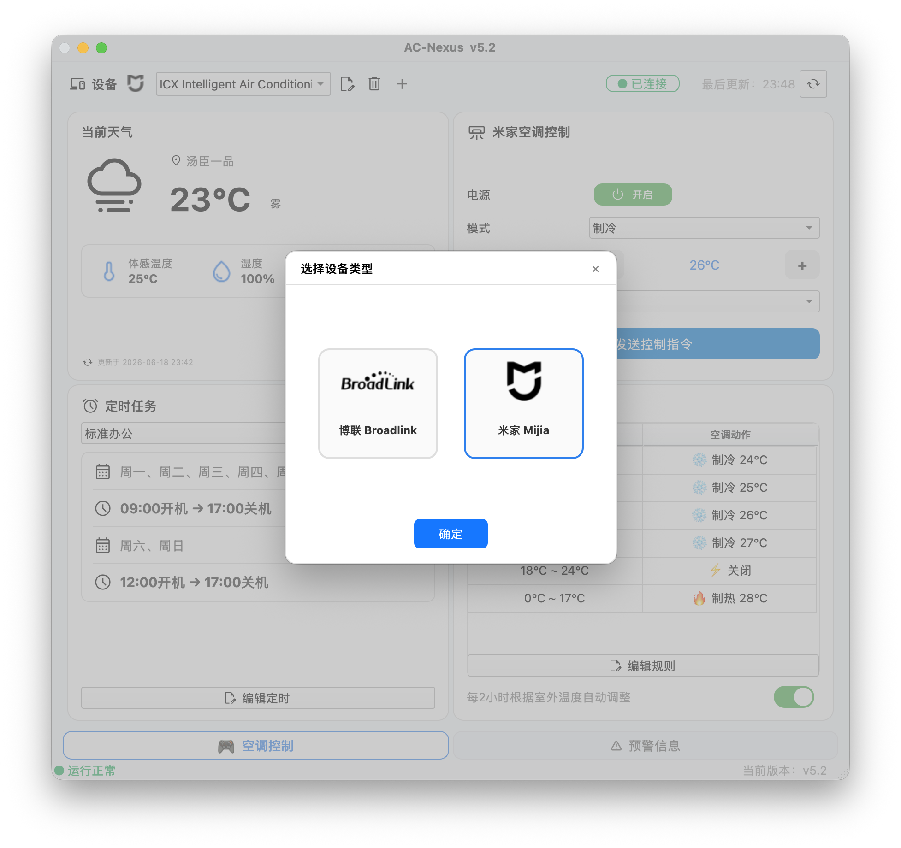

# 🌀 AC-Nexus v5.3.1

[中文](README.md) | English

**The world's first AC controller with intelligent storm safety protection.** Real-time wind speed + distance analysis intelligently determines whether to shut down ACs to protect outdoor units — stronger storms trigger protection at greater distances, while tropical depressions are automatically excluded to prevent false shutdowns. A feature no other smart home platform offers.

Broadlink + Xiaomi MIoT dual-ecosystem support, Xiaomi's massive code library + built-in **17 common AC brand IR protocols**, plus **IR learning** for any unsupported brand. AI Agents control AC with one line of Python via `import acnexus_core`. Desktop app runs on all platforms — download and go, with a complete user guide that ensures even beginners can get started quickly.

## 📸 Screenshots

| Main Interface | Typhoon & Alerts |
|----------------|------------------|
|  |  |

| Device Switch (Broadlink / Mijia) | Settings |
|-----------------------------------|----------|
|  |  |

## 🤖 Agent API

```python
from acnexus_core import init, send_ac

init(api_key="your_key", qw_host="https://your_host",
     location={"lat": 22.54, "lon": 114.05, "name": "Shenzhen"})

send_ac("on", "cool", 26, "auto")                     # control AC
send_ac("off", "cool", 26, "auto", mac="e870723f")    # specific device

# Storm threat assessment — unique feature
from acnexus_core import typhoon_threat_distance, typhoon
dist, name = typhoon_threat_distance()
alerts = typhoon.judge_and_shutdown(print)  # Wind-speed + distance tiered shutdown, one call
```

No GUI needed — `pip install -r requirements-core.txt` is enough.

## 🎯 Built-in Protocols

17 AC IR protocols, fully covered in desktop dropdown with clean, recognizable brand logos.

| Gree | Midea | Haier | AUX | Hisense | Daikin | Mitsubishi | Panasonic | Hitachi |
|------|-------|-------|-----|---------|--------|------------|-----------|---------|
| Fujitsu | Ballu | Carrier | Hyundai | Fuego | Wahin | Xiaomi | — | — |

**All MIoT-compatible IR devices can be added to the system**, leveraging Xiaomi's massive code library, with full support in both Agent mode and the desktop app.

Agent accepts Chinese or English: `brand="Hitachi"` or `brand="日立"` — auto-resolved.
**A ready-to-use skill file is included in the project, giving AI Agents complete guidance to unlock the full potential.**

## ✨ Features

- 🌪️ **Storm protection** — Intelligent wind-speed + distance tiered logic (Cat 3+ <100km / Cat 1-2 <70km / default <50km), tropical depressions excluded, auto-shutdown + pause scheduler
- 📡 **Dual ecosystem** — Broadlink RM LAN discovery + Xiaomi MIoT cloud login with QR code
- 🎓 **IR learning** — Teach the system codes from your original remote for any brand
- ⏰ **Schedule templates** — Multi-group timers with flexible date and time slot configuration
- 🌡️ **Smart temp** — Adaptive cooling/heating based on outdoor temperature, fully customizable rules
- 🌤️ **Dual weather** — Baidu / QWeather API real-time weather + alerts (completely free)
- 🌀 **Dual storm** — NMC NW Pacific typhoons + NHC Atlantic hurricanes, path forecast chart, covering all major global storm regions
- 🎨 **Dark theme** — Light / dark / follow system
- 🌐 **Bilingual (ZH/EN)** — JSON-based i18n, instant switch without touching functional code
- 🔧 **Diagnostics** — One-click environment, dependency & device health check

## 🚀 Quick Start

| Platform | Download |
|----------|----------|
| 🪟 Windows | [AC-Nexus.exe](https://github.com/oywq00008-cell/AC-Nexus/releases/latest/download/AC-Nexus-Windows.zip) |
| 🍎 macOS | [AC-Nexus.app](https://github.com/oywq00008-cell/AC-Nexus/releases/latest/download/AC-Nexus-macOS.zip) |
| 🐧 Linux | [AC-Nexus-linux](https://github.com/oywq00008-cell/AC-Nexus/releases/latest/download/AC-Nexus-linux.tar.gz) |

From source:

```bash
git clone https://github.com/oywq00008-cell/AC-Nexus.git
cd AC-Nexus
pip install -r requirements.txt
python ac_controller_pyside6.py
```

## 🧰 Hardware

- Python 3.9+
- [Broadlink RM series](https://www.broadlink.com.cn/) or Xiaomi MIoT IR blaster

## 📁 Structure

```
ac_controller_pyside6.py      # Entry point
acnexus_core/             # Core library (zero GUI deps)
├── ac_control.py             # AC control + dynamic protocols
├── scheduler.py              # Scheduling
├── typhoon.py                # Dual-source storms
├── weather.py                # Dual-source weather
├── ir_learner.py             # IR learning
├── xiaomi_cloud.py            # Xiaomi QR login + crypto
├── xiaomi_cloud.py           # Xiaomi cloud API
├── xiaomi_local.py           # Xiaomi LAN control
├── config.py                 # Configuration
└── logger.py                 # Logging
acnexus_desktop/          # PySide6 desktop
├── app_pyside6.py            # Main window
└── pyside/                   # UI modules
protocols/                    # Custom IR protocols
```
## 📁 OpenWRT Router Version

[AC-Nexus-OpenWRT](https://github.com/oywq00008-cell/AC-Nexus-OpenWRT)
An AC-Nexus version rewritten specifically for OpenWrt routers; it retains all key features of the original while remaining extremely lightweight, with code redesigned for low-performance routers.

## 🔐 Privacy

All config stored locally at `~/.ac_controller/`. Nothing uploaded.

## 📜 License

MIT License

## 💝 Acknowledgments

- [python-broadlink](https://github.com/mjg59/python-broadlink) — Broadlink RM driver
- [python-miio](https://github.com/rytilahti/python-miio) — MIoT local network protocol
- [hvac_ir](https://github.com/nicko858/hvac_ir) — IR protocol library
- [IRremoteESP8266](https://github.com/crankyoldgit/IRremoteESP8266) — C++ protocol reference
- [miot-spec.org](https://miot-spec.org) — Xiaomi device siid/piid specifications
- [OpenStreetMap](https://www.openstreetmap.org) — City search (Nominatim)
- [QWeather](https://www.qweather.com) / [Baidu Maps](https://lbsyun.baidu.com) — Weather data
- [China NMC](https://www.nmc.cn) — NW Pacific typhoon data
- [USA NHC](https://www.nhc.noaa.gov) — Atlantic hurricane data
- [schedule](https://github.com/dbader/schedule) — Python job scheduling
