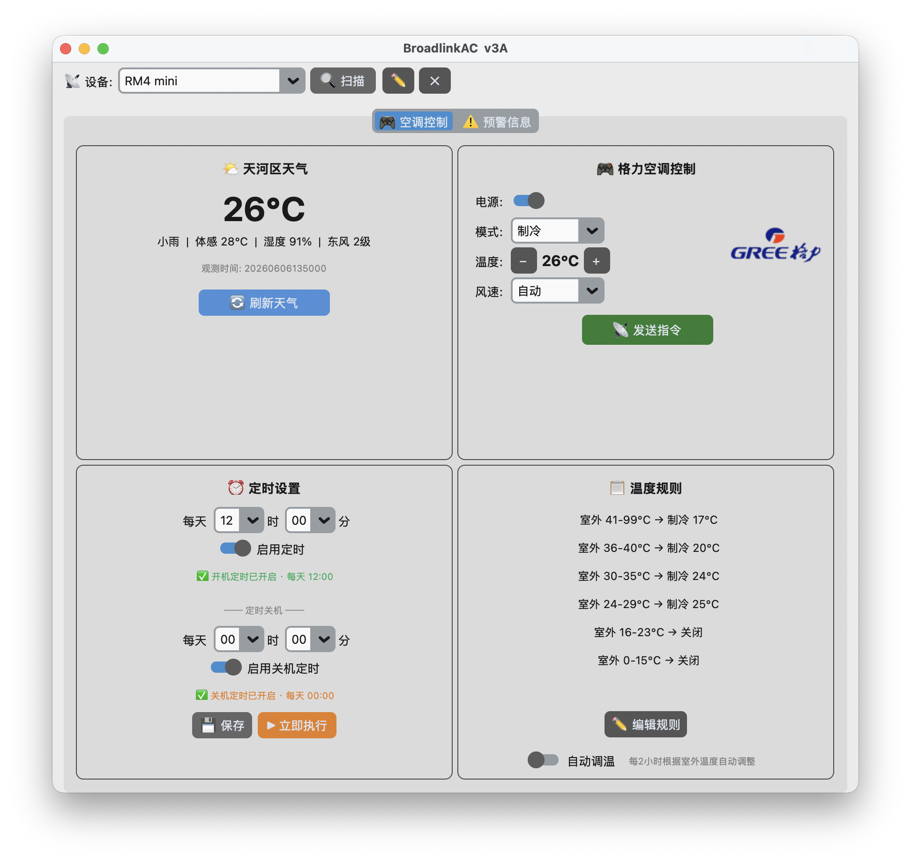
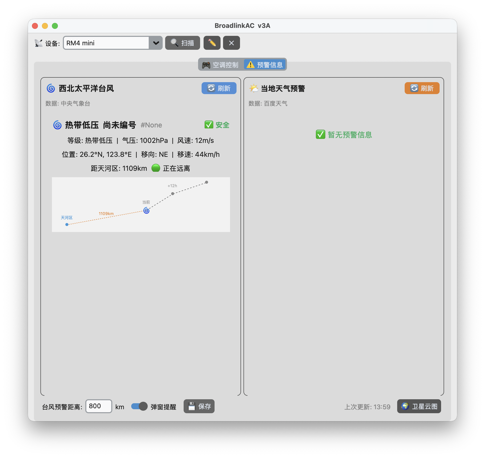
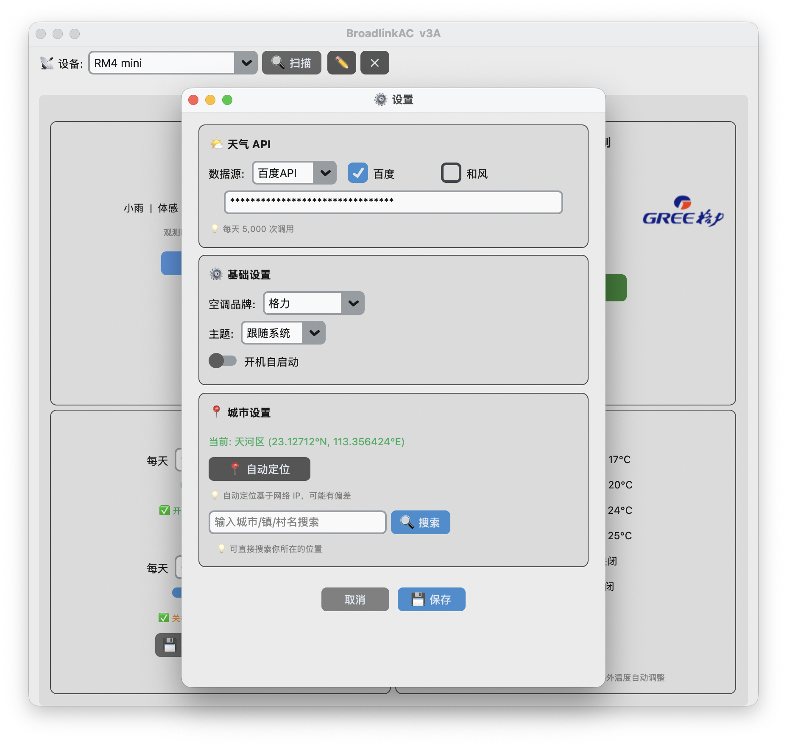

# 🎮 BroadlinkAC v3A

[中文](README.md) | English

BroadlinkAC is more than a desktop AC remote — it's an **IR control protocol stack built for AI Agents**. Plug in a Broadlink RM IR blaster, and any AI Agent can control **17 AC brands** (Gree, Hitachi, Daikin, etc.) with a single line of Python: `import broadlinkac_core`. Multi-device parallel scheduling, outdoor-temperature-aware auto-adjust, typhoon alerts — the desktop app and headless Agent mode share the exact same core. Windows, macOS & Linux, works out of the box.





## 🤖 Agent API

```python
from broadlinkac_core import init, send_ac, get_device_list

# One-time init (auto-persisted to config.json)
init(api_key="your_key", qw_host="https://your_host",
     location={"lat": 22.54, "lon": 114.05, "name": "Shenzhen"})

# Control AC — brand name auto-resolved to IR protocol
send_ac("on", "cool", 26, "auto")                    # current device
send_ac("off", "cool", 26, "auto", mac="e870723f")   # specific device

# Multi-device
for mac, name in get_device_list():
    print(f"{name}: {mac}")

# Storm threat assessment
from broadlinkac_core import typhoon_threat_distance
dist, name = typhoon_threat_distance()
if dist < 100:
    send_ac("off", "cool", 26, "auto", source="typhoon")  # auto-shutdown near storm
```

No GUI needed — `pip install -r requirements-core.txt` is enough.

> `send_ac` only guarantees power/mode/temp/fan — the minimum common set across all brands. If your AC supports turbo, swing, etc., your Agent can extend `broadlinkac_core/ac_control.py` with optional parameters.

## 🎯 Supported AC Brands

The core supports all **17 protocols** (desktop dropdown shows 10 Chinese brands).

| Brand (CN) | Brand (EN) | Protocol Source |
|------------|------------|-----------------|
| 格力 | `gree` | hvac_ir |
| 美的 / 华凌 / 小米 | `midea` | hvac_ir |
| 海尔 | `haier` | Custom protocols |
| 奥克斯 | `aux_ac` | Custom protocols |
| 海信 | `hisense` | hvac_ir |
| 大金 | `daikin` | hvac_ir |
| 三菱 | `mitsubishi` | hvac_ir |
| 松下 | `panasonic` | Custom protocols |
| 日立 | `hitachi` | hvac_ir |
| 富士通 | `fujitsu` | hvac_ir |
| 巴鲁 | `ballu` | hvac_ir |
| 开利 | `carriermca` | hvac_ir |
| 现代 | `hyundai` | hvac_ir |
| Fuego | `fuego` | hvac_ir |

Agent can pass either Chinese `brand="日立"` or English `brand="hitachi"` — both resolve automatically. Additional hvac_ir brands not listed (e.g. `carriernqv`, `daikin2`) also work by passing the module name directly.

## ✨ Features

- 📡 **Multi-device** — LAN auto-discovery, dropdown switch, offline label
- ⏰ **Parallel scheduling** — Per-device independent timers and auto-adjust
- 🌡️ **Temperature rules** — Adaptive cool/heat based on outdoor temp
- 🌤️ **Dual weather** — Baidu / QWeather API, one-click switch
- 🌀 **Dual storm source** — NW Pacific (NMC) + N. Atlantic hurricanes (NHC)
- 🌪️ **Storm protection** — Auto-shutdown all ACs when storm < 100km
- ⚠️ **Alerts** — Local warnings with 10-sec auto-dismiss
- 🎨 **Brand logos** — Dynamic control panel icon
- 📋 **Activity log** — Daily auto-logging
- 🔧 **Diagnostics** — One-click health check

## 🧰 Hardware

- Python 3.9+ (macOS / Windows / Linux / Raspberry Pi / NAS)
- [Broadlink RM series](https://www.broadlink.com.cn/) IR blaster

## 🚀 Quick Start

### Desktop App

| Platform | Download |
|----------|----------|
| 🪟 Windows | [BroadlinkAC.exe](https://github.com/oywq00008-cell/BroadlinkAC-For-Agent/releases/latest/download/BroadlinkAC-Windows.zip) |
| 🍎 macOS | [BroadlinkAC.app](https://github.com/oywq00008-cell/BroadlinkAC-For-Agent/releases/latest/download/BroadlinkAC-macOS.zip) |
| 🐧 Linux | [BroadlinkAC-linux](https://github.com/oywq00008-cell/BroadlinkAC-For-Agent/releases/latest/download/BroadlinkAC-linux.tar.gz) |

> 💡 All packages are auto-built by GitHub Actions and updated with every release.

macOS first run:
```bash
xattr -cr /Applications/BroadlinkAC.app
```

From source:
```bash
git clone https://github.com/oywq00008-cell/BroadlinkAC-For-Agent.git
cd BroadlinkAC-For-Agent
pip install -r requirements.txt
python ac_controller.py
```

### Agent / Headless

```bash
pip install -r requirements-core.txt
```

```python
from broadlinkac_core import init, send_ac
init()
send_ac("on", "cool", 26, "auto")
```

## ⚙️ Configuration

Fill in weather API key via Settings on first run (Baidu 5k/day or QWeather 50k/mo, free). Broadlink devices auto-discovered on LAN. Agent mode: pass via `init()` or edit `~/.ac_controller/config.json` directly.

## 📁 Project Structure

```
ac_controller.py              # Entry point
broadlinkac_core/             # Core library (zero GUI deps)
├── __init__.py               # Public API
├── config.py                 # Config + resolve_brand() + device mgmt
├── weather.py                # Dual-source weather + alerts
├── typhoon.py                # Typhoon (NMC) + Hurricane (NHC) + threat eval
├── ac_control.py             # AC control + dynamic protocol import
├── scheduler.py              # Scheduling
└── logger.py                 # Logging
broadlinkac_desktop/          # Desktop GUI
└── app.py
protocols/                    # Custom IR protocols (haier/aux_ac/panasonic)
logos/                        # Brand logos
assets/                       # Screenshots
skill/                        # Agent Skill definition (SKILL.md)
BroadlinkAC.spec              # PyInstaller config
requirements.txt              # Full deps
requirements-core.txt         # Agent-only deps
```

## 🔐 Privacy

All config stored locally at `~/.ac_controller/`. Nothing uploaded.

## 📜 License

MIT License

## 💝 Acknowledgments

- [python-broadlink](https://github.com/mjg59/python-broadlink) — Broadlink RM driver
- [hvac_ir](https://github.com/nicko858/hvac_ir) — IR protocol library
- [IRremoteESP8266](https://github.com/crankyoldgit/IRremoteESP8266) — C++ protocol reference
- [QWeather](https://www.qweather.com) / [Baidu Maps](https://lbsyun.baidu.com) — Weather data
- [China NMC](https://www.nmc.cn) — Typhoon data
